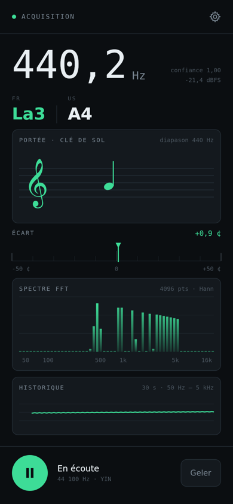
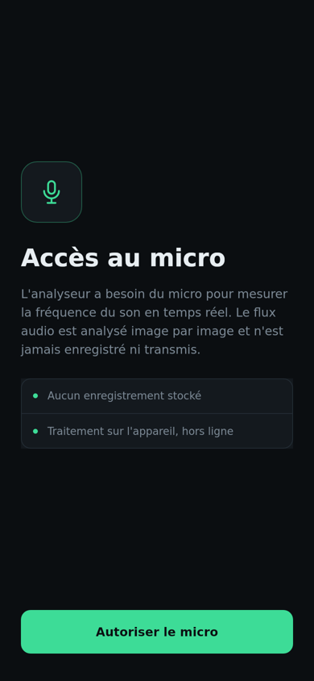
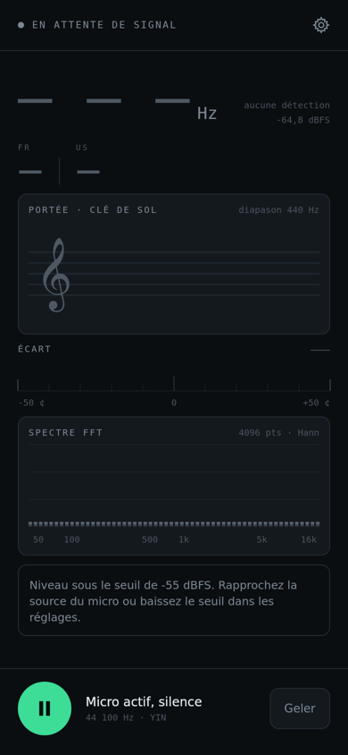
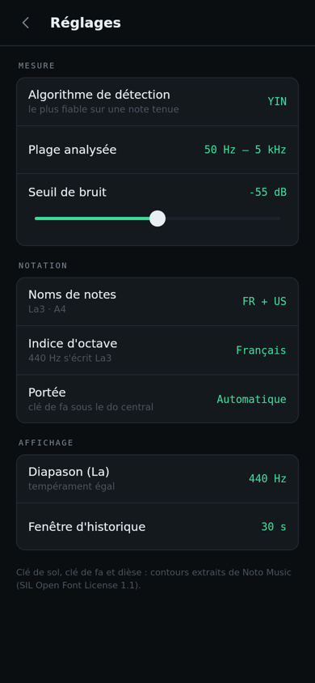

# Frequency Analyser

Une application Android qui écoute le micro et vous dit **quelle note vous entendez** : la fréquence
en hertz, le nom de la note en notation française **et** américaine, et sa place sur une portée.

Accorder une guitare, vérifier un diapason, savoir quelle note siffle votre bouilloire, mesurer le
bourdonnement d'un transformateur : tout se lit sur un seul écran.

<p align="center">
  
</p>

---

## Installer

> L'application n'est pas sur le Play Store : elle s'installe à partir du fichier `.apk` publié ici.
> Android 8.0 minimum.

**1. Télécharger l'APK**

Rendez-vous sur la page [**Releases**](../../releases/latest) et téléchargez le fichier
`frequency-analyser.apk` — directement depuis le téléphone, c'est le plus simple.

**2. Ouvrir le fichier téléchargé**

Depuis la notification de téléchargement, ou dans l'application **Fichiers** → *Téléchargements*.

**3. Autoriser l'installation**

Android affiche « Pour votre sécurité, votre téléphone n'est pas autorisé à installer des
applications inconnues provenant de cette source ». C'est normal : le message apparaît pour toute
application qui ne vient pas du Play Store.

- appuyez sur **Paramètres** ;
- activez **Autoriser depuis cette source** ;
- revenez en arrière et appuyez sur **Installer**.

Google Play Protect peut ensuite proposer d'analyser l'application : acceptez ou choisissez
*Installer quand même*.

**4. Autoriser le micro**

Au premier lancement, l'application explique pourquoi elle a besoin du micro, puis Android demande
l'autorisation. Sans elle, aucune mesure n'est possible.

<p align="center">
  
</p>

> Le son n'est **jamais enregistré ni transmis** : il est analysé image par image, sur le téléphone,
> sans aucune connexion réseau. L'application ne demande d'ailleurs pas l'accès à Internet.

---

## Utiliser

Approchez le téléphone de la source sonore et jouez une note tenue. L'écran se met à jour environ
vingt fois par seconde.

### Ce que montre l'écran principal

| Zone | Ce qu'elle dit |
| --- | --- |
| **440,2 Hz** | la fréquence mesurée, le chiffre le plus précis de l'écran |
| **confiance 0,98** | à quel point le son est franc ; en dessous de 0,5 rien n'est affiché |
| **−21,4 dBFS** | le volume qui arrive au micro (0 = saturation, −60 = très faible) |
| **FR La3 · US A4** | la note la plus proche, dans les deux notations |
| **Portée** | la même note, écrite en clé de sol (ou de fa dans le grave) |
| **Écart** | de combien vous êtes à côté, en centièmes de demi-ton : vert si c'est juste, ambre au-delà de 15 |
| **Spectre FFT** | toutes les fréquences présentes ; la barre claire est celle qui est mesurée |
| **Historique** | l'évolution des 30 dernières secondes — pratique pour voir un vibrato ou une corde qui se détend |

### Les deux boutons du bas

- le **bouton rond** met la mesure en pause et relâche le micro ; appuyez à nouveau pour reprendre ;
- **Geler** fige l'affichage sur la dernière mesure, le temps de la lire ou de la montrer, sans
  couper le micro.

### Accorder un instrument

1. jouez une corde à vide ;
2. regardez le nom de la note : c'est bien celle que vous visez ?
3. regardez l'aiguille d'**Écart** : tendez la corde si elle penche à gauche (bémol), détendez-la si
   elle penche à droite (dièse) ;
4. c'est juste quand l'aiguille est au centre et verte.

Repères pour une guitare en accordage standard : **Mi2 · La2 · Ré3 · Sol3 · Si3 · Mi4** (notation
française), soit E2 · A2 · D3 · G3 · B3 · E4.

### Quand rien ne s'affiche

<p align="center">
  
</p>

L'application affiche `— — —` et vous dit pourquoi : le niveau est sous le seuil de bruit. Dans ce
cas, rapprochez la source du micro, ou baissez le seuil dans les réglages. C'est voulu : mieux vaut
n'afficher aucune note que commenter le bruit de la pièce.

---

## Les réglages

<p align="center">
  
</p>

Appuyez sur la roue dentée en haut à droite. **Chaque ligne se change en appuyant dessus** : la
valeur passe à la suivante.

### Mesure

| Réglage | À quoi ça sert |
| --- | --- |
| **Algorithme de détection** | `YIN` convient à presque tout et ne se trompe pas d'octave : gardez-le. `FFT + HPS` peut aider sur un son très riche, `Autocorrélation` sur un son très pur. |
| **Plage analysée** | restreindre la plage écarte les fausses détections. `Voix` pour chanter ou parler, `50 Hz – 5 kHz` par défaut, `30 Hz – 8 kHz` pour une basse ou un sifflement. |
| **Seuil de bruit** | en dessous de ce niveau, l'application se tait. Baissez-le dans une pièce silencieuse pour capter des sons faibles ; remontez-le dans un endroit bruyant. |

### Notation

| Réglage | À quoi ça sert |
| --- | --- |
| **Noms de notes** | afficher les deux notations, ou seulement la française, ou seulement l'américaine. |
| **Indice d'octave** | `Français` écrit le 440 Hz **La3** (convention traditionnelle française) ; `Scientifique` l'écrit **La4**, comme le `A4` américain. Choisissez celle qu'on vous a apprise. |
| **Portée** | `Automatique` passe en clé de fa sous le do central ; vous pouvez forcer l'une ou l'autre clé. |

### Affichage

| Réglage | À quoi ça sert |
| --- | --- |
| **Diapason (La)** | de 435 à 445 Hz. Laissez 440 sauf si votre ensemble accorde ailleurs (442 est courant en orchestre). Tout le reste suit. |
| **Fenêtre d'historique** | 10, 30 ou 60 secondes de courbe. |

---

## Bon à savoir

**Pourquoi La3 et pas La4 ?** Les deux sont justes. La notation française traditionnelle appelle le
440 Hz *la3*, la notation scientifique et américaine l'appelle *A4* : elles décalent l'indice d'une
unité. L'application affiche les deux côte à côte, et le réglage *Indice d'octave* permet de les
aligner.

**Que veut dire `8va` sur la portée ?** Que la note est trop aiguë pour la portée et qu'elle est
écrite une octave plus bas — `15ma`, deux octaves. C'est la convention des partitions. Le grave
utilise `8vb` et `15mb`.

**L'écran reste allumé**, volontairement : on lit une mesure en jouant, les mains occupées.

**Ce que l'application ne fait pas** : elle n'enregistre pas, n'exporte pas, ne reconnaît pas les
accords (elle donne une note à la fois, la plus présente), et ne remplace pas un sonomètre — le
niveau en dBFS est relatif au micro, pas en décibels acoustiques.

**Précision** : mieux que deux centièmes de demi-ton sur un son tenu, ce qui est au-delà de ce qu'on
distingue à l'oreille. Le micro du téléphone reste le maillon faible : il colore les graves et sature
si la source est trop près.

---

## Pour les développeurs

Kotlin + Jetpack Compose, aucune dépendance de traitement du signal : FFT, YIN, autocorrélation et
tracé de la portée sont écrits dans le projet.

```bash
./gradlew testDebugUnitTest   # 17 tests du traitement du signal, sans appareil
./gradlew assembleDebug       # app/build/outputs/apk/debug/app-debug.apk
./gradlew installDebug        # sur un téléphone branché en débogage USB
```

Chaque push construit l'APK dans GitHub Actions. Pour publier une *release* : onglet **Actions** →
*Tests et APK* → **Run workflow**, en renseignant le tag (`v1.0.1`, par exemple) ; le workflow crée le
tag, la release et y attache l'APK. Pousser un tag `v*` produit le même résultat.

### Comment la mesure est faite

1. **Capture** — `AudioRecord` sur la source la moins traitée que le téléphone accepte
   (`UNPROCESSED`, sinon `VOICE_RECOGNITION`, sinon `MIC`), 48 ou 44,1 kHz, mono 16 bits. La fenêtre
   d'analyse fait 4096 échantillons et avance de 2048 : environ 21 mesures par seconde.
2. **Niveau** — valeur efficace de la trame, en dBFS ; sous le seuil réglé, la détection est
   suspendue plutôt que de commenter du bruit de fond.
3. **Hauteur** — trois algorithmes au choix :
   - **YIN** (défaut) : différence moyenne cumulée normalisée puis interpolation parabolique. Le
     plus fiable sur une note tenue, et sans erreur d'octave sur un son riche en harmoniques.
   - **FFT + HPS** : pic de FFT corrigé par repliement harmonique, avec recherche de la
     sous-harmonique qui explique le mieux les partiels observés.
   - **Autocorrélation** : corrélation normalisée, premier sommet après la première retombée.
4. **Note** — conversion en numéro MIDI par rapport au diapason réglé, puis nom, altération, écart
   en cents et degré diatonique pour le placement sur la portée.

### Organisation du code

```
app/src/main/java/com/ofthestreet/frequencyanalyzer/
├── analysis/      capture micro, FFT, YIN, bandes de spectre, orchestration par trame
├── music/         noms de notes FR/US, degrés de portée, glyphes musicaux vectoriels
├── settings/      réglages persistés (DataStore)
├── ui/            écrans et tracés Compose
└── AnalyzerViewModel.kt
```

`tools/render/` compile l'application et dessine ses écrans en PNG **sans SDK Android**, en
s'appuyant sur Compose Multiplatform et le `android-all` de Robolectric — c'est ce qui a produit les
captures de ce README. Voir `tools/render/README.md`.

La clé de sol, la clé de fa et le dièse sont les contours des glyphes de la police **Noto Music**
(SIL OFL 1.1) convertis en chemins vectoriels : aucune police n'est embarquée, et la portée s'affiche
de la même façon partout. Voir `THIRD-PARTY-NOTICES.md`.
